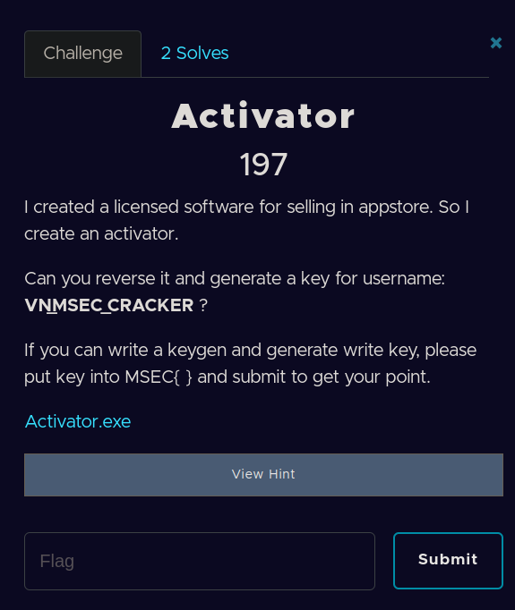
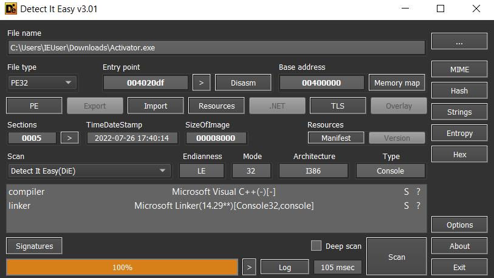
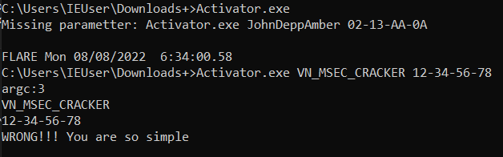
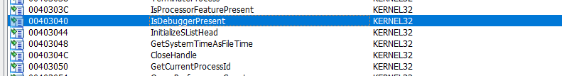
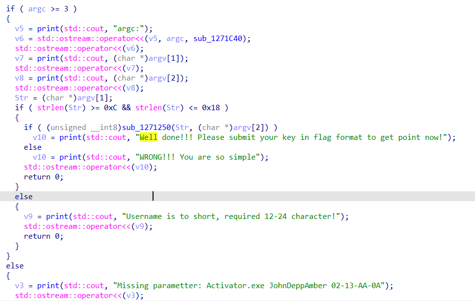
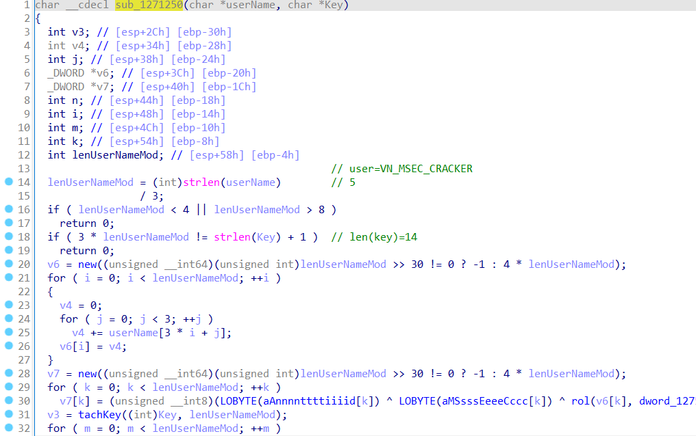
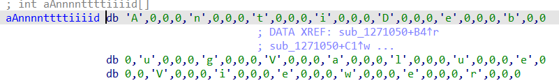
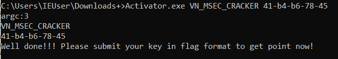

​									


​		Challenge cho một file exe, yêu cầu tạo một key cho username **VN_MSEC_CRACKER**. Mình load vào DIE xem thử thì biêt đây là một file PE32 bit.

S				

​		Chạy file xem thử 

​									

​		Chúng ta load file lên IDA xem thử. Nhìn vào bảng import ta thấy có hàm IsDebuggerPresent để AntiDebug, mình có cài plugin để bypass rồi nên bỏ qua.



​		Tiếp theo mình xem xét hàm main của nó.

​		

​		Chương trình hiển thị flow khá rõ ràng , đầu tiên là kiểm tra số tham số có lớn hơn 3 hay không , nếu không sẽ thông báo lỗi. Tiếp theo chương trình in ra chuỗi argc , số tham số truyền vào và các số tham số truyền vào. TIếp theo hàm kiếm tra chuỗi tham số thức nhất tức Username có lớn hơn 12 và nhỏ hơn 18 hay không, nếu không sẽ print ra lỗi.

​		Tiếp theo chương trình sẽ kiểm tra hàm sub_1271250() với hai tham số chuyền vào là username và key để hiển thị chuỗi Well done hay Wrong. Chúng ta sẽ xem xét hàm sub_1271250.

​			

​		Xem xét hàm ta thấy dòng 14 đến 20, để chắc chắn độ dài Username lớn hơn 12 , nhỏ hơn 24 và độ dài key phải nhỏ hơn độ dài userName 1 đơn vị.

​		Do chúng ta đã xác định được username là VN_MSEC_CRACKER nên bây giờ chúng ta chỉ cần xem xét yếu tố cần dùng liên quan đến key, còn các biến thay đổi do username có thể debug để lấy giá trị. 

​		Ta chú ý dòng thứ 31, hàm sub_B81130 mà mình đổi tên thành tachKey có tham số truyền vào là Key và với và len(UserName) / 3 . Xem xét hàm thì biết được hàm này tach key ra thành 1 mảng lưu lại ở biến v3. Ví dụ 12-34-56-78 sẽ tách thành mảng 12,34,56,78. 

​		Ở dòng 32,33 mảng v3 được tạo sẽ được xor vào từng kí tự trong mảng kí tự 'AntiDebugValueViewer', sau đó sẽ được so sánh với mảng v7.

Mảng v7 chúng ta có thể sử dụng debug để lấy giá trị.

​					

​		Dưới đây là chuỗi đoạn script để tạo key.						

```
    userName='VN_MSEC_CRACKER'
    lenUserNameMod= int(len(userName)/3)
    v6=[]
    v7=[0,0xda,0xc2,0x11,0x1]
    strAntidebug='AntiDebugValueViewer'
    for i in range(lenUserNameMod):
        v4=0
        for j in range(3):
            v4=v4+ord(userName[3*i+j])
        v6=v6+[v4]
    serial=""
    for i in range(lenUserNameMod):
        check=False
        for number in range(0,256):
            if (number ^ ord(strAntidebug[i])&0xff) == v7[i]:
                serial = serial+str(hex(number))[2:]
                check=True
        if not check:
            print("index",i,"not find")
        else:
            serial=serial+'-'
    serial=serial[0:-1]
    print(serial)
```

​		Key được tạo : **41-b4-b6-78-45**

​		