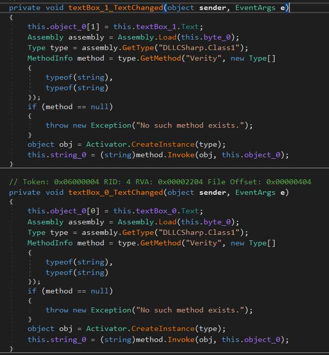

​					

Chạy thử chương trình ta thấy chương trình , khi ấn button Get Flag ta thấy tin ra một dialog rỗng.

DIE báo đây là một file .Net đã được làm rối bởi Obfuscar 1.0.  

Mình search ra một github https://github.com/XenocodeRCE/DEObfuscar để DEObfuscar. Sau đó load vào DnSpy xem thử.

Ta thấy các class của nó, ta xem thử chương trình từ hàm Main. Hàm main gọi một class GForm0 để hiển thị giao diện và xử lý.

​									

Xem xét xử lý button GET FLAG thấy hàm hiện ra một MessageBox chứa string_0. Xem xét các hàm liên quan đến string0  ta tìm được các hàm sau:

​									

​		Khi hai ô textbox để nhập username và password thay đổi dữ liệu thì hai hàm trên được gọi. Nhìn chung hai hàm trên giống nhau, hai hàm sẽ tìm hàm Verity ở Class1 của DllCSharp. Kết quả trả về sẽ được lưu ở biến string_0. Tìm kiếm trong resource ta thấy có một file PE cũng bị Obfuscar, mình cũng tiến hàng DeObfuscar và load vào DnSpy, đọc hàm Verity của Class1.

​									

​		Hàm này sẽ kiểm tra username nhập vào có phải là admin hay không và password sẽ được cho vào hàm method7. Xem xét method7:

​								

​	Hàm này sẽ base64 password và so sánh với chuỗi dm5fbXNlYw==.  Decode base64 chuỗi trên ta được string password là vn_msec.

​	Đến đây ta nhập vào chương trình xem thử.

MessengerBox hiện ra flag.

**FLAG: MSEC{Assembly_all_over_the_world}**

​				