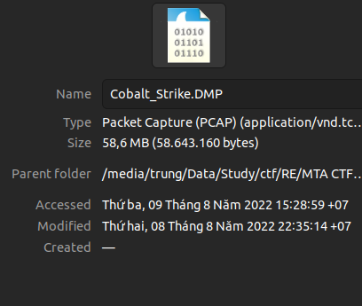
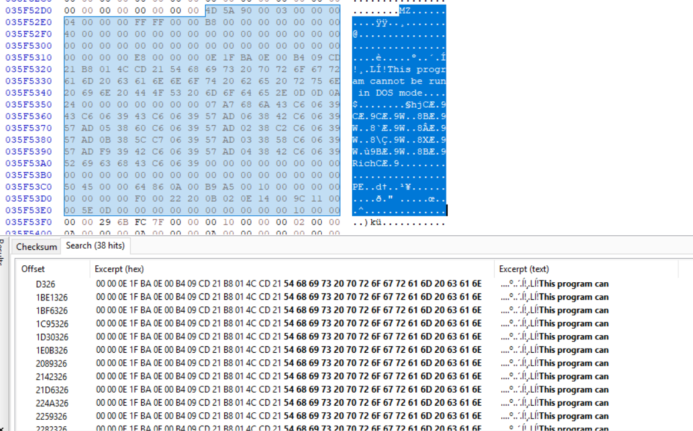
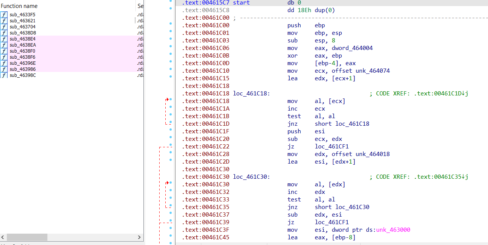
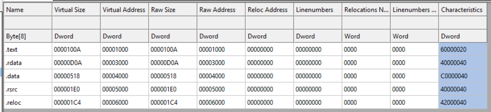
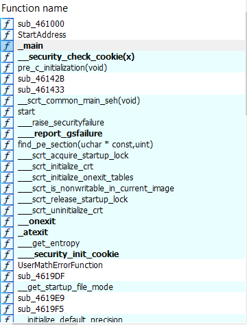
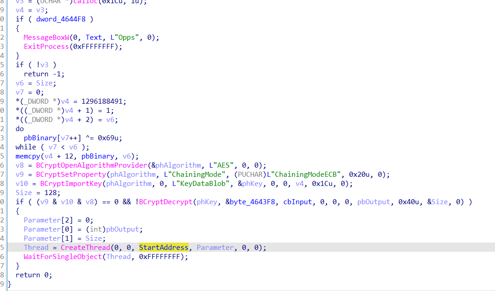
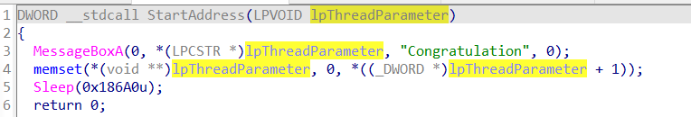

​					

​		Đề bài cho một file đuôi DMP, xem dung lượng của file khá lớn.

​									

​	Mình search google thì biết đây file DMP là file được dump từ memory ra. Mình mở HXD xem qua file, thì thấy có nhiều dấu hiệu của PE File. Thực ra là mình được hint nên biết trước trong đó có file PE rồi.

​							

​		Mình dump tất cả các file PE ra, sau đó dùng DIE để kiểm tra thì thấy có rất nhiều file dll và một file exe.

​												

​		Mình thử cho vào IDA xem thử 


​							

​		Sau một hồi phân tích tĩnh thử thì không thu được thông tin gì . Mình chợt nhớ ra đây là một file PE được dump ra từ memory nên lúc này các section đang được load theo Virtual Size và Virtual Address. Bởi vậy mình mở CFF Explorer ra và sửa đại chỉ Raw Size và Raw Address giống với Virtual Size và Virtual Address.

​				

​		Load lại vào IDA mình thấy code đã đẹp và các funtion đã hiển thị chính xác.

​						

​		Xem xét hàm main : 

​			


Ở đây mình thấy chương trình kiểm tra gì đó rồi in ra Flag : **FLAG{Flag real đã bay màu}**. Mình submit thử thì thấy không đúng. Mình xem thử lại luồng bên kia 

​		

​	Mình thấy có hàm StartAddress, mình mở xem thì thấy có tạo một Messagebox với tiêu đề là "Congratulation" với nội dung hiển thị là Parameter truyền vào nên đoán đây mới là luồng chính xác.

​					

​		Mình xác định được đây là mã hóa AES với mode ECB. Từ đó mình viết một đoạn script giải mã.


```
from Crypto.Util.Padding import pad, unpad
from Crypto.Cipher import AES
from Crypto.Random import get_random_bytes
import struct

buffer=[  0x20, 0x24, 0x95, 0x5E, 0x32, 0xD5, 0x82, 0x43, 0x0F, 0x92, 
  0xC4, 0xD8, 0x39, 0xBC, 0xC9, 0x56, 0xFD, 0x13, 0x9B, 0xB0, 
  0x1C, 0x5D, 0xD4, 0x90, 0x4E, 0x6B, 0xA7, 0x63, 0xDB, 0x75, 
  0xA8, 0x79, 0x74, 0x25, 0x40, 0x6C, 0xBA, 0x23, 0x42, 0x36, 
  0x6F, 0x6D, 0x9B, 0x8E, 0x95, 0x0F, 0x28, 0x70, 0xF2, 0xFA, 
  0x9C, 0x6E, 0x73, 0x3D, 0xD7, 0x24, 0x3E, 0xC5, 0x7F, 0x22, 
  0x34, 0x48, 0x7C, 0x66]

pbBinary=[ 0x01, 0x6B, 0xA7, 0x2B, 0xD9, 0x7B, 0x29, 0xB5, 0xF7, 0xEE, 
  0x34, 0x51, 0xF1, 0xE5, 0xBB, 0x8C]

pbBinary=bytes(pbBinary)
cipher2 = AES.new(pbBinary, AES.MODE_ECB)
print(cipher2.decrypt(bytes(buffer)))
```

​	**FLAG: MSEC{chUC_Mun6_3M_d4_Nh4N_du0C_1_cu_vND!!!!!!!!} **

