​				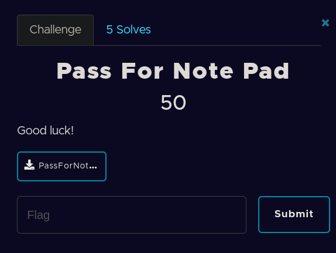

​		Đề bài cho một file zip, giải nén ra ta được 3 file như dưới đây. 

​							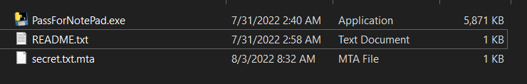

​		Nhìn biểu tượng con rắn ở file *PassForNotePad.exe* và dung lượng file khá lớn ta đóan ngay đây là một chương trình python được biên dịch ra file exe.

​		Ta xem thử các file khác xem thế nào, thì file README.txt hướng dẫn cách sử dụng chương trình gồm -d đẻ giả mã và -e để mã hóa và mật khẩu ít  nhất 8 kí tự.

​								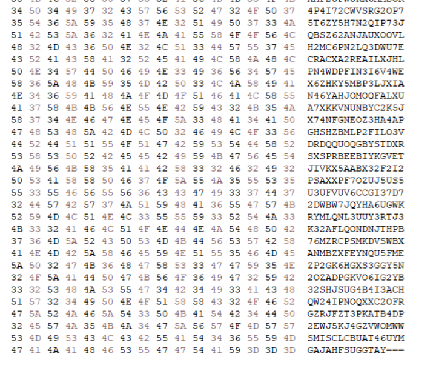

​		Xem qua file secret.txt.mta mình thấy có 3 dấu === ở cuối nên mình đoán ở đây là một đoạn base64, thử giải mã nó thì k thu được thông tin gì nhiều nên mình tạm thời bỏ qua. 

​		Tiếp tục với file *PassForNotePad.exe* , mình dùng pyinstxtractor.py để extracted. 

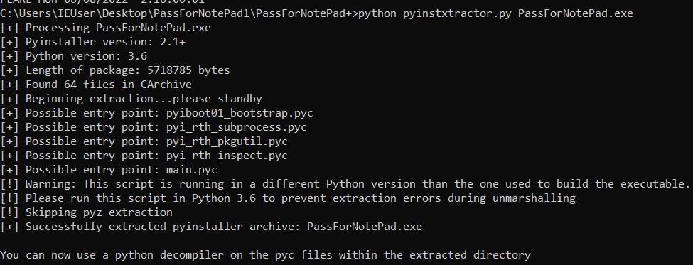

​										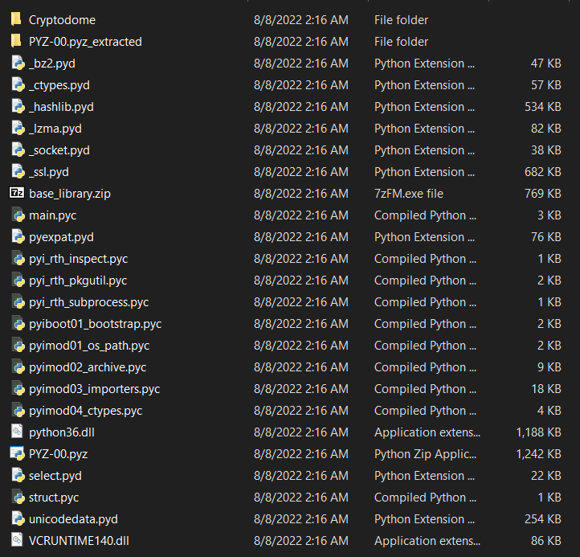				

​		Mình chú ý file main.pyc, thử dùng uncompyle6 để chuyển sang file .py.  Nhưng tools báo lỗi, mình thử so sánh file main.pyc với một file pyc bình thường xem sao.

​									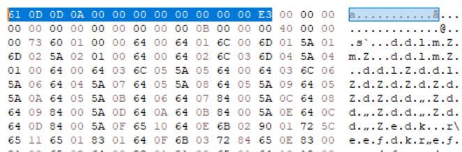

​																									*Main.pyc*

​									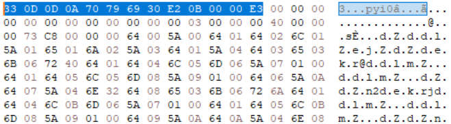

​																									*File pyc bình thường*

​		Ta tiến hành patch lại file main.pyc và decompyle lại xem sao.

​									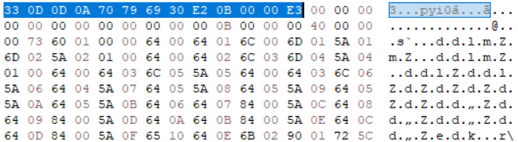


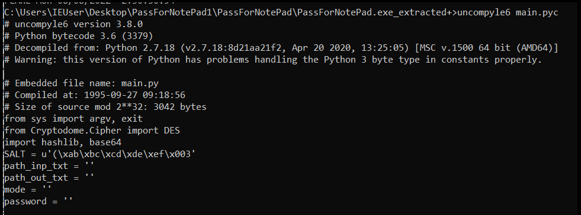

​		File đã được decompile thành py thành công. Dưới đây là code của file main.py

```
# uncompyle6 version 3.8.0
# Python bytecode 3.6 (3379)
# Decompiled from: Python 2.7.18 (v2.7.18:8d21aa21f2, Apr 20 2020, 13:25:05) [MSC v.1500 64 bit (AMD64)]
# Warning: this version of Python has problems handling the Python 3 byte type in constants properly.

# Embedded file name: main.py
# Compiled at: 1995-09-27 09:18:56
# Size of source mod 2**32: 3042 bytes
from sys import argv, exit
from Cryptodome.Cipher import DES
import hashlib, base64
SALT = u'(\xab\xbc\xcd\xde\xef\x003'
path_inp_txt = ''
path_out_txt = ''
mode = ''
password = ''

def fnEncrypt(path_inp_txt, path_out_txt):
    f_inp = open(path_inp_txt, 'rb')
    f_out = open(path_out_txt, 'w')
    d_inp = f_inp.read()
    d_intern = b''
    d_out = b''
    key = password[6] + password[5] + password[0] + password[2]
    m = hashlib.md5(key.encode('utf-8'))
    key = m.digest()
    key = key.hex()
    f_out.write(key)
    key = password[6] + password[5] + password[0] + password[2] + SALT
    m = hashlib.md5(key.encode('utf-8'))
    key = m.digest()
    dk, iv = key[:8], key[8:]
    crypter = DES.new(dk, DES.MODE_CBC, iv)
    d_inp += b'\x00' * (8 - len(d_inp) % 8)
    d_intern = crypter.encrypt(d_inp)
    d_out = base64.b32encode(d_intern)
    f_out.write(d_out.decode('utf-8'))
    f_inp.close()
    f_out.close()


def fnDecrypt(path_inp_txt, path_out_txt):
    f_inp = open(path_inp_txt, 'r')
    f_out = open(path_out_txt, 'wb')
    d_inp = f_inp.read()
    d_intern = b''
    d_out = b''
    password_in_file = d_inp[:32]
    d_inp = d_inp[32:]
    key = password[6] + password[5] + password[0] + password[2]
    m = hashlib.md5(key.encode('utf-8'))
    key = m.digest()
    key = key.hex()
    if key != password_in_file:
        print('Wrong password!')
        return
    d_intern = base64.b32decode(d_inp)
    key = password[6] + password[5] + password[0] + password[2] + SALT
    m = hashlib.md5(key.encode('utf-8'))
    key = m.digest()
    dk, iv = key[:8], key[8:]
    crypter = DES.new(dk, DES.MODE_CBC, iv)
    d_out = crypter.decrypt(d_intern)
    f_out.write(d_out)
    f_inp.close()
    f_out.close()

def fnInfo():
    print('use [-e|-d] file password')
    print('Your password must be at least 8 characters')
    print('-e: encrypt')
    print('-d: decrypt')


def fnIsPassWordValid(psswrd):
    if len(psswrd) < 8:
        return False
    else:
        return True
        
if __name__ == '__main__':
    if len(argv) != 4:
        fnInfo()
        exit(0)
    else:
        mode = argv[1]
        path_inp_txt = argv[2]
        password = argv[3]
        if fnIsPassWordValid(password) == False:
            print('Your password must be at least 8 characters')
            exit(0)
        try:
            f = open(path_inp_txt, 'r')
            f.close()
        except FileNotFoundError:
            print('File not found. Check the path variable and filename')
            exit(0)

    if mode == '-e':
        path_out_txt = path_inp_txt + '.mta'
        fnEncrypt(path_inp_txt, path_out_txt)
        exit(0)
    else:
        if mode == '-d':
            path_out_txt = path_inp_txt[:-4]
            fnDecrypt(path_inp_txt, path_out_txt)
            exit(0)
        else:
            print('e: encrypt')
            print('d: decrypt')
            exit(0)
# okay decompiling main.pyc
```

​		Cơ bản đoạn code này gồm hai hàm chính là hàm mã hóa và  hàm giải mã . Mình đọc sơ qua thì hàm mã hóa sẽ sử dụng 4 kí tự trong mật khẩu và lưu mã md5 của nó vào trong file đuôi .mta và tiến hành thêm vào cuối mã md5 chuỗi SALT . Sử dụng 24 kí tự đầu và 24 kí tự cuối của mã md5 được thêm SALT đó để làm key và IV cho thuật toán mã hóa DES. Output thuật toán DES được qua base64 rồi ghi vào file đuôi mta.

​		Hàm giải mã đọc md5 của 4 kí tự trong password được sử dụng trong hàm mã hóa rồi so sánh với 4 kí tự trong password mình nhập. Nếu so khớp thì tiến hành decode base64 và decrypt DES  theo cách ngược lại rồi tiến hành ghi vào file. Mình đọc 32 kí tự đầu trong file mã hóa và lên mạng search plaintext md5 của nó.

​																	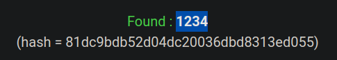

​		Ta tìm được chuỗi 1234. Ta tạo một mật khẩu thỏa mãn điều kiện của chương trình để giải mã file secret.txt.mta.

​			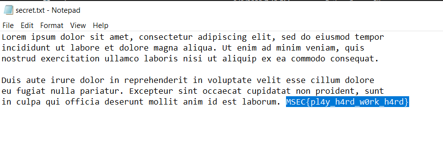


Giải mã file ta tìm được flag cần tìm.

**FLAG: MSEC{pl4y_h4rd_w0rk_h4rd}**

