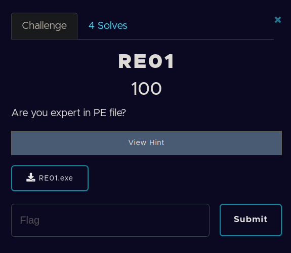
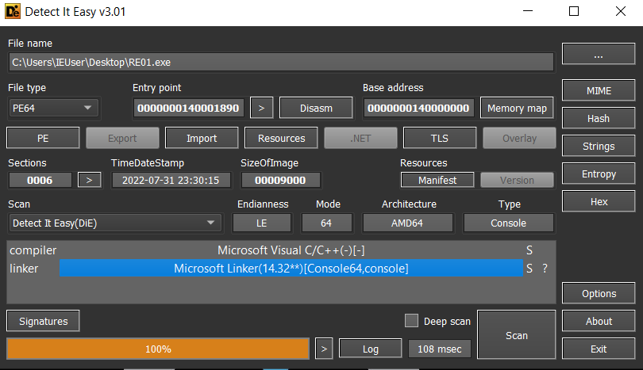
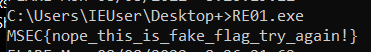
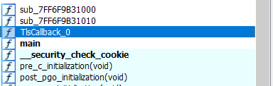
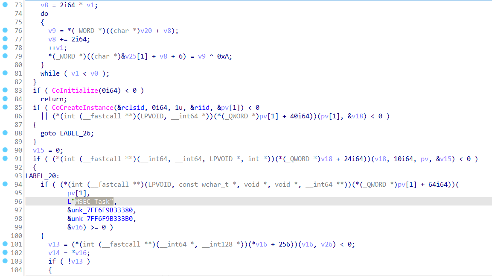
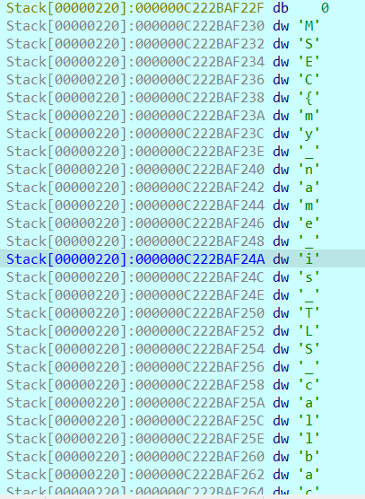

​		DIE chỉ ra rằng đây là một PE64

​										

​		Chạy chương trình thử: 

​														

​		Chương trình in ra chuỗi flag giả, ta thử load file vào IDA64, mình thấy xuất hiện TLS Callback_0.

​													

​		Linh tính của mình là phải xem qua hàm TlsCallback trước

​		Mình thấy hint 'MSEC Task' nên đoán chương trình chứa flag ở đây. Tiến hành đặt breakpoint ở hàm này xem xét thử.

​								

​		Thế là flag xuất hiện, mình k biêt tác giả ra đề còn có phương pháp nào không , nhưng thấy flag rồi nên mình cũng không suy nghĩ thêm nữa.

​		**FLAG:  MSEC{my_name_is_TLS_callback_hope_you_fun!}**

​		

​		