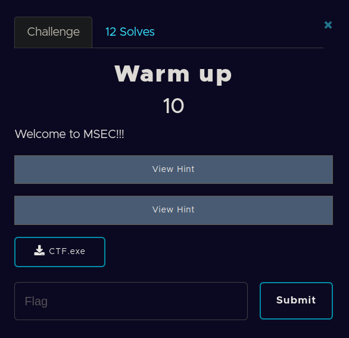
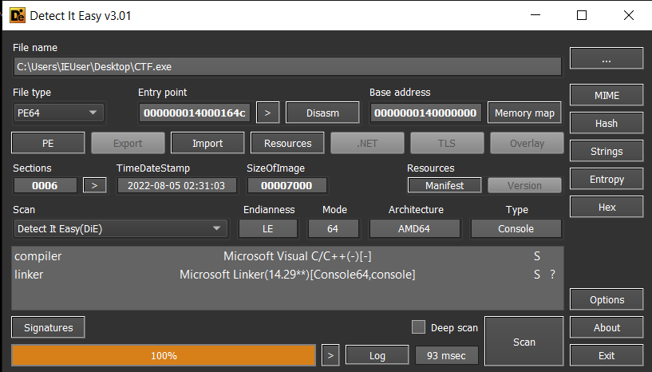
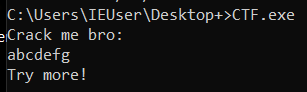
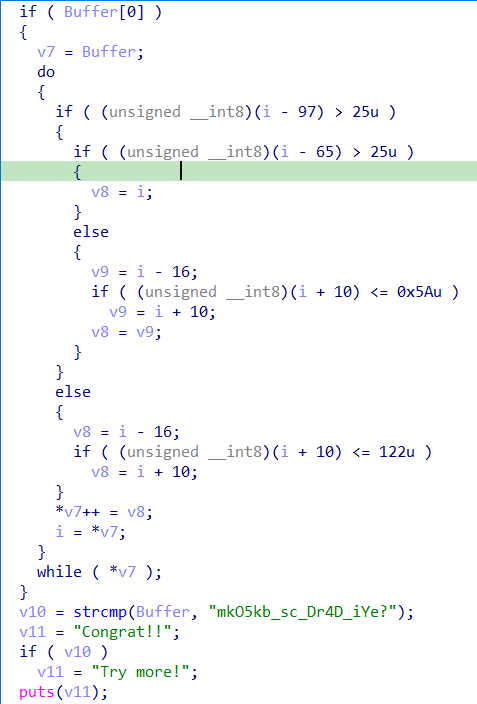

​		Challenge cho một file pe CTF.exe , mình kiểm tra bằng phần mềm Detect It Easy cho biết đây là một file PE64.



​		Mình thử chạy file , cho kết quả như sau:



​		Tiến hành load file vào IDA64. Ta thấy đầu tiên file PE tiến hành gọi hàm puts và puts chuỗi string *"Crack me bro:"* ra màn hình. Sau đó, chương trình gọi fgets để lấy input người dùng nhập vào rồi lưu vào biến Buffer. Chuỗi buffer được đưa vào một hàm biến đổi như dưới đây.




​		Chuỗi Buffer được người dùng nhập vào sau khi biến đổi sẽ so sánh với chuỗi *"mkO5kb_sc_Dr4D_iYe?"* , nếu so khớp sẽ đưa ra thông báo chúc mừng. Mình thấy bài này có khá nhiều người làm được nên mình sẽ show đoạn scirpt mình dùng để giải bài này luôn.

```
out="mkO5kb_sc_Dr4D_iYe?"
result=""
for iout in out:
    for i in range(30,256):
        if (i - 97)&0xff > 25 :
            if (i -65)&0xff >25:
                v8=i
            else:
                v9=i-16
                if (i+10)&0xff<=0x5a:
                    v9=i+10
                v8=v9
        else:
            v8=i-16
            if (i+10) &0xff<0x7a:
                v8=i+10
        if v8==ord(iout):
            result=result+chr(i)
            break
result='MSEC{'+result+'}'
print(result)
```

​		**FLAG: MSEC{caE5ar_is_Th4T_yOu?}**

